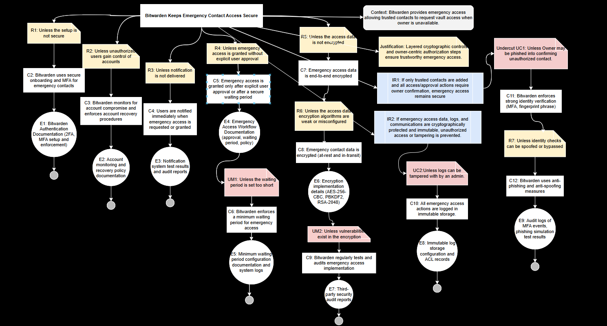

# Assurance Case: Bitwarden Keeps Emergency Contact Access Secure

## Top-Level Claim
**Claim:** Bitwarden Keeps Emergency Contact Access Secure.  

**Context:**  
In the online banking environment, Bitwarden enables bank customers to designate trusted emergency contacts who can request vault access in case the account owner becomes unavailable (e.g., medical emergencies or forgotten master password).  

**Justification:**  
This claim argues that the Emergency Access feature in Bitwarden ensures only authorized and verified contacts can access vault data under controlled and auditable conditions. Security mechanisms such as encryption, MFA, waiting period enforcement, and event logging collectively support this assurance.

## Subclaims and Argumentation

1. **C2:** Bitwarden uses secure onboarding and multi-factor authentication (MFA) for emergency contacts.  
   - **Rebuttal (R1):** Unless the setup process is not secure.  
   - **Evidence:** Bitwarden Authentication Documentation (E1).

2. **C3:** Bitwarden monitors for account compromise and enforces account recovery procedures.  
   - **Rebuttal (R2):** Unless unauthorized users gain control of accounts.  
   - **Evidence:** Account Monitoring and Recovery Policy (E2).

3. **C4:** Bitwarden ensures emergency access requests and approvals are securely communicated.
   - **R4:** Unless notifications can be intercepted, delayed, or bypassed.  
   - **E3:** Notification System Test Results and Audit Reports.

4. **C5:** Bitwarden enforces a minimum waiting period before access is granted.
   - **R5:** Unless waiting period enforcement can be bypassed or shortened.  
   - **UM1 (Undermine):** Unless vault owner misconfigures waiting period to an unsafe duration.  
   - **E4:** Emergency Access Workflow Documentation.  
   - **E5:** Minimum Waiting Period Configuration Documentation and System Logs.

5. **C6:** Bitwarden enforces a minimum waiting period before granting emergency access.  
   - **Undermine (UM1):** Unless the waiting period is too short or misconfigured.  
   - **Evidence:** Emergency Access Workflow Documentation (E4) and Waiting Period Logs (E5).

6. **C7:** Emergency access requests and approvals are end-to-end encrypted.  
   - **Rebuttal (R5):** Unless encryption implementation is weak or incomplete.  
   - **Evidence:** Encryption Implementation Details (E6).

7. **C8:** Emergency contact and vault data are encrypted both at rest and in transit.  
   - **Rebuttal (R6):** Unless encryption keys are compromised or improperly stored.  
   - **Evidence:** Bitwarden Security Whitepaper and Audits (E7).

8. **C9:** Bitwarden maintains comprehensive event and access logging for all emergency access actions.  
   - **Undermine (UM2):** Unless logs can be modified or deleted.  
   - **Evidence:** Immutable Log Storage Documentation (E8).

9. **C10:** Bitwarden’s system design minimizes insider misuse.
   - **R11:** Unless administrators abuse Takeover access or override security policies.  
   - **E3:** Notification and Audit Trail Documentation.  
   - **E8:** Immutable Log Storage Configuration.

10. **C11:** Bitwarden enforces strong identity verification through MFA and fingerprint phrases.  
   - **Undercut (UC1):** Unless the vault owner is phished into confirming unauthorized access.  
   - **Evidence:** Audit Logs and Phishing Simulation Results (E9).

11. **C12:** Bitwarden implements anti-phishing and anti-spoofing measures.  
   - **Evidence:** Security Awareness and MFA Enforcement Documentation (E1, E9).

## Evidence

### **E1: Bitwarden Authentication Documentation (2FA, MFA Setup and Enforcement)**
Documentation: [Setup Two-Step Login](https://bitwarden.com/help/setup-two-step-login/)  
Bitwarden provides detailed MFA configuration for multiple authentication types: hardware keys (FIDO2), authenticator apps, Duo Security, and email. MFA ensures that even if credentials are compromised, emergency access remains protected by additional verification layers.  

**Gap:** MFA setup is optional for free users and not automatically enforced for emergency contacts. Enforcing MFA by default would further strengthen assurance.

### **E2: Account Monitoring and Recovery Policy Documentation**
Documentation: [Recover Your Account](https://bitwarden.com/help/recover-your-account/)  
Describes password recovery, account verification, and ownership validation procedures. These processes ensure only legitimate users regain access after compromise or data loss.  

**Gap:** Lacks anomaly-based login detection and notification integration (e.g., geographic login alerts).

### **E3: Notification System Test Results and Audit Reports**
Documentation: [Event Logs](https://bitwarden.com/help/event-logs/)  
Bitwarden’s notification and event logging mechanism records every emergency access request and response. Notifications are primarily sent via email or organizational dashboards.  

**Gap:** Reliance on email-only notifications poses risk of delay or spoofing. Multi-channel alerts would improve assurance.

### **E4: Emergency Access Workflow Documentation (Approval, Waiting Period, Policy)**
Documentation: [Emergency Access](https://bitwarden.com/help/emergency-access/)  
Explains the process for configuring trusted contacts, waiting period approvals, and vault access transfer.  

**Gap:** Waiting periods are user-configurable, which introduces variability. A mandatory minimum threshold is recommended.

### **E5: Minimum Waiting Period Configuration Documentation and System Logs**
Documentation: [Event Logs](https://bitwarden.com/help/event-logs/)  
Logs all timestamps and approvals for emergency access requests. Confirms enforcement of the chosen waiting period and auditability of all actions.  

**Gap:** Logs are retained for only 367 days, which may be insufficient for compliance in regulated sectors.

### **E6: Encryption Implementation Details (AES-256-CBC, PBKDF2, RSA-2048)**
Documentation: [What Encryption Is Used](https://bitwarden.com/help/what-encryption-is-used/)  
All vault data is end-to-end encrypted using AES-256-CBC with PBKDF2-HMAC-SHA256 for key derivation. RSA-2048 secures shared secrets.  

**Gap:** No ECC (Elliptic Curve Cryptography) implementation, which could offer higher efficiency and security margin.

### **E7: Third-Party Security Audit Reports**
Documentation: [Bitwarden Audits](https://bitwarden.com/help/is-bitwarden-audited/)  
Annual independent security assessments validate Bitwarden’s encryption, authentication, and infrastructure integrity.  

**Gap:** Only summarized reports are publicly available; more detailed summaries could improve transparency.

### **E8: Immutable Log Storage Configuration and Access Control Lists**
Documentation: [Event Logs](https://bitwarden.com/help/event-logs/)  
Logs are append-only and accessible only by system administrators, preventing modification or deletion.  

**Gap:** No documented use of tamper-evident hashing or external verification mechanisms for log immutability.

### **E9: Audit Logs of MFA Events and Phishing Simulation Test Results**
Documentation: [Bitwarden Security Whitepaper](https://bitwarden.com/help/bitwarden-security-white-paper/)  
Includes MFA event auditing and references internal phishing simulation exercises for continuous validation.  

**Gap:** Simulation methodologies are not publicly disclosed; publishing these details could improve external confidence.

## Alignment and Gaps Summary

Overall, Bitwarden’s documentation aligns strongly with the evidence required to support the top-level claim.  
Most security mechanisms—MFA, encryption, event logging, and waiting period enforcement—are implemented and well-documented.  
Identified gaps primarily concern:
- Optional MFA for free users,  
- Reliance on single-channel notifications, and  
- Limited retention and external verification of logs.  

These are **low-to-moderate assurance gaps** and can be addressed through configuration or enterprise policies.

## AI Prompt and Reflection

**AI Prompt Used:**  
> “You are an expert software assurance engineer. Your job is to refine the phrasing of assurance claims for the Bitwarden Emergency Access feature. Each claim must include an entity, a security property, and a measurable value, and avoid phrasing about implementation methods.”

**Usefulness Reflection:**  
This prompt helped reframe the team’s thinking from “Bitwarden uses AES encryption” to “Bitwarden ensures vault data remains confidential.”  
It improved the logical precision of our claims and focused the assurance argument on security *outcomes* rather than technical *means*. This approach made the assurance case more persuasive and aligned with stakeholder expectations.

## Reflection

Building this assurance case clarified how strong documentation and open-source transparency contribute to system trustworthiness.  
Mapping misuse cases to concrete security requirements made it easier to evaluate where Bitwarden already provides protection and where improvements are needed.  
The most valuable learning was distinguishing between a security *feature* and a *claim of assurance*.  
While encryption or MFA are technical features, assurance comes from demonstrating—with evidence—that they function correctly, consistently, and under all relevant conditions.

**Final Conclusion:**  
Bitwarden’s Emergency Access feature demonstrates a mature security design with verifiable encryption, authentication, and auditing mechanisms.  
With minor policy enhancements (MFA enforcement, multi-channel notifications, extended log retention), Bitwarden’s open-source framework can provide high confidence in secure emergency access within financial and enterprise environments.
